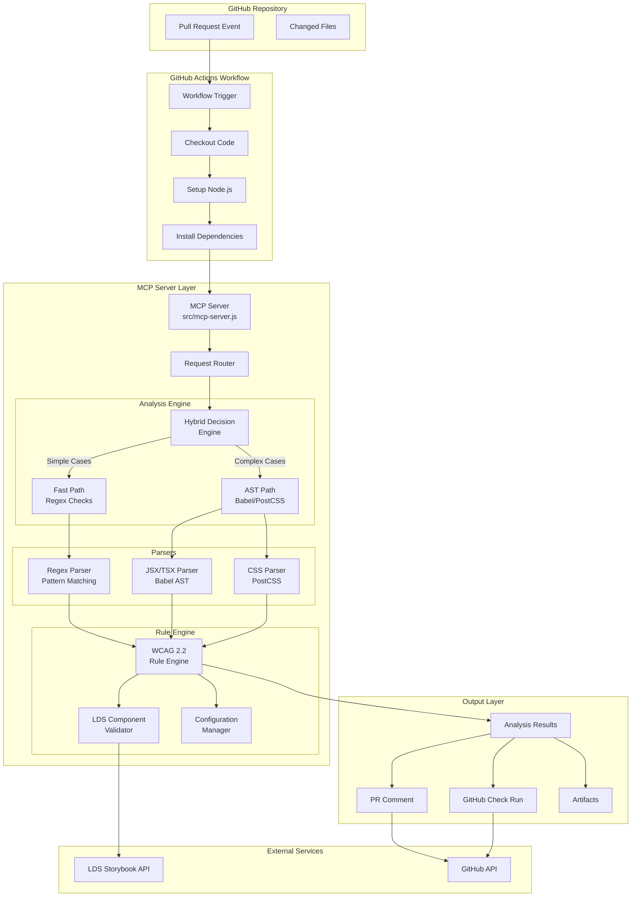
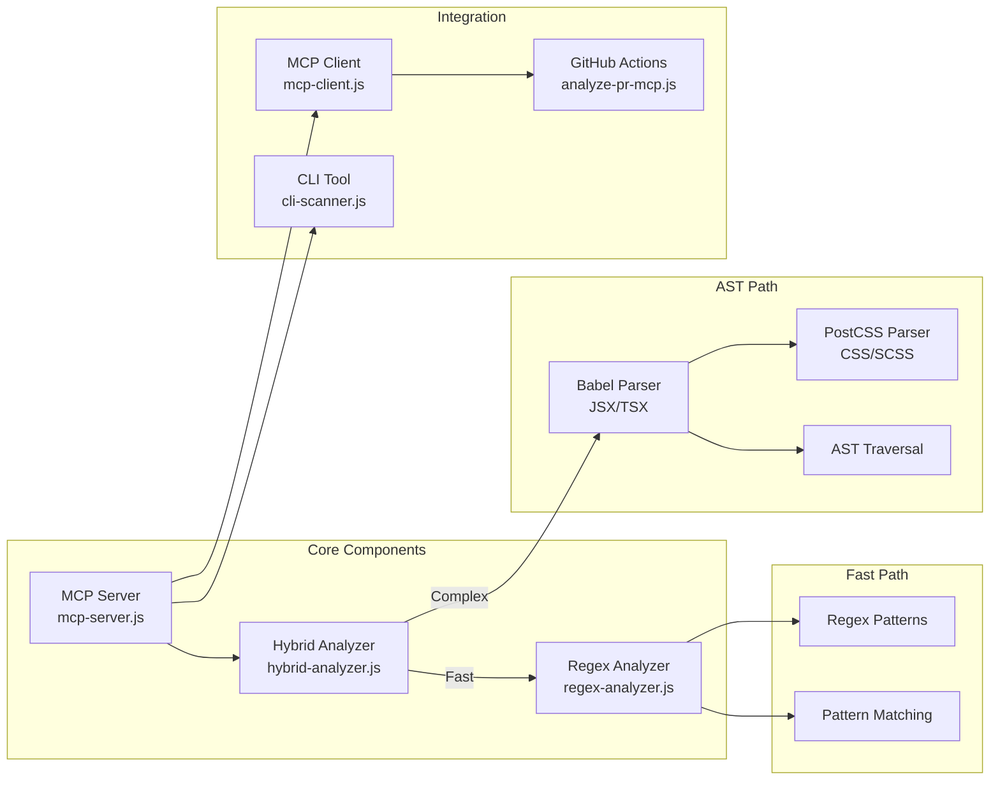
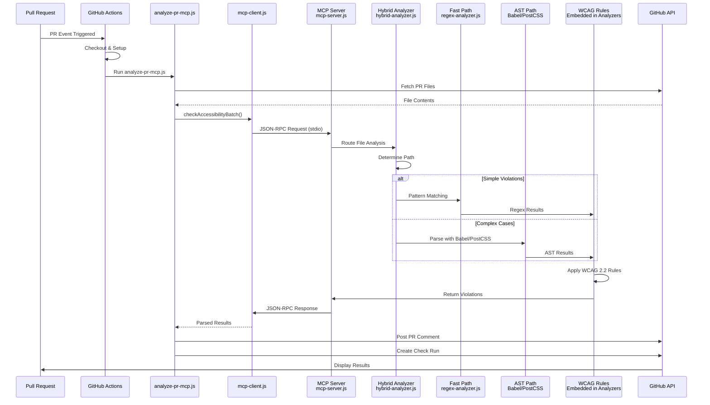
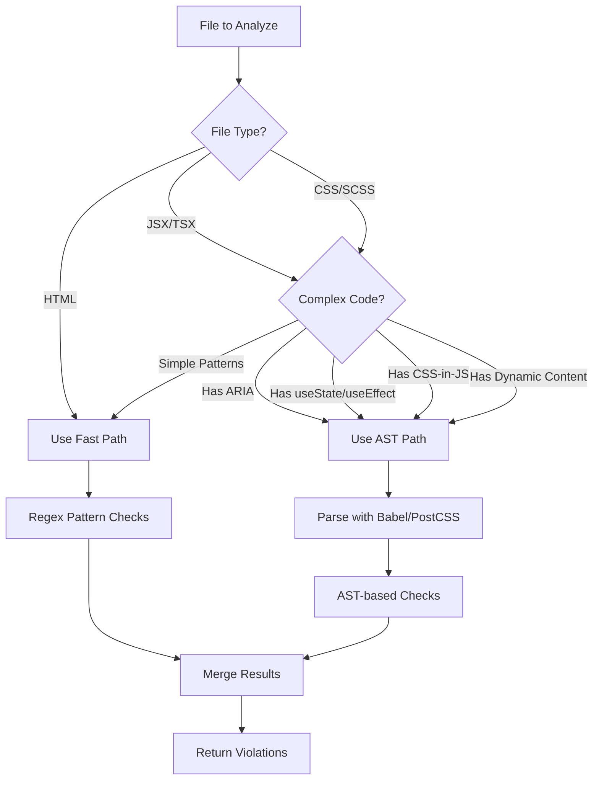
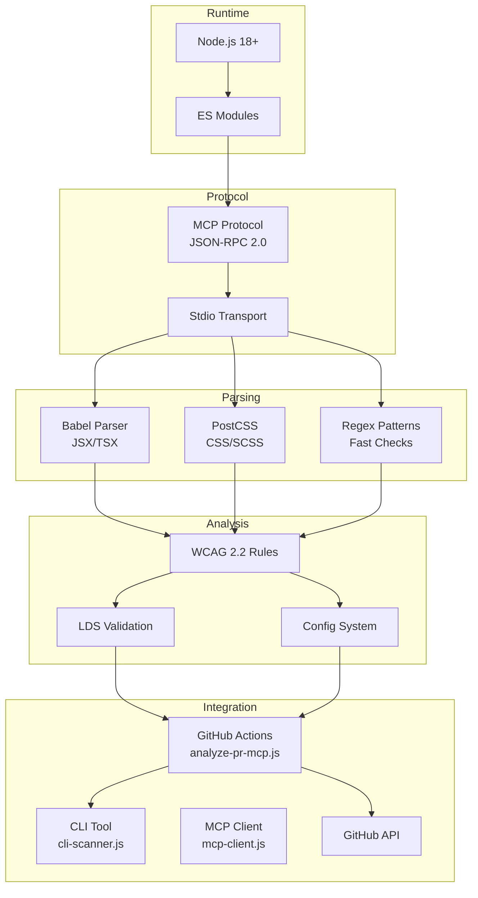

# Architecture Diagram - GitHub Accessibility Reviewer MCP

## System Architecture Overview



- **Starting from the top**: When a developer creates a Pull Request, GitHub Actions automatically triggers
- **Workflow setup**: The system checks out code, sets up Node.js, and installs dependencies
- **MCP Server**: This is the heart of our system - it receives requests via JSON-RPC protocol
- **Hybrid Decision Engine**: The smart routing system decides whether to use fast regex (1-5ms) or AST parsing (50-200ms) based on code complexity
- **Two analysis paths**: Simple violations like missing alt text use regex (fast), while complex cases with ARIA or React hooks use AST parsing (accurate)
- **Rule Engine**: All results go through WCAG 2.2 rule validation - currently 15+ checks implemented
- **Output**: Results are posted as PR comments, check runs, and artifacts for detailed review
- **Note on LDS**: The LDS Storybook integration is shown but is planned for Phase 2 (not yet implemented)

---

## Component Architecture



- **Core Components**: Three main files - MCP server, hybrid analyzer, and regex analyzer
- **Fast Path**: Uses simple regex patterns for 80% of cases - very fast (1-5ms per file)
- **AST Path**: For complex code, we use Babel for JSX/TSX and PostCSS for CSS - slower but more accurate
- **Integration Layer**: Shows how the system connects to GitHub Actions, CLI tools, and MCP clients
- **Key Point**: The hybrid analyzer automatically chooses the best path - developers don't need to think about it
- **File Names**: All actual file names are shown so developers know exactly what to look for in the codebase

---

## Data Flow



- **Timeline view**: This shows the step-by-step flow from PR creation to results display
- **Step 1-2**: GitHub Actions triggers and sets up the environment automatically
- **Step 3-4**: The analyzer fetches changed files from GitHub API - only analyzes what changed in the PR
- **Step 5-6**: MCP client communicates with MCP server via JSON-RPC over stdio - this is the standardized protocol
- **Step 7-9**: The hybrid analyzer makes a decision - simple code goes to fast path, complex code goes to AST path
- **Step 10-11**: WCAG rules are applied to all findings - this is where violations are identified
- **Step 12-14**: Results flow back through the system and are posted to the PR
- **Key Point**: The entire process is automated - no manual intervention needed

---

## Hybrid Decision Logic



- **Decision Tree**: This flowchart shows exactly how the system decides which analysis path to use
- **File Type Check**: First, we check if it's HTML, JSX/TSX, or CSS/SCSS
- **Complexity Detection**: For JSX/TSX and CSS, we look for complexity indicators:
  - ARIA attributes (needs semantic understanding)
  - React hooks like useState/useEffect (dynamic behavior)
  - CSS-in-JS patterns (needs parsing)
  - Dynamic content generation
- **Simple = Fast Path**: If none of these are found, we use regex (1-5ms)
- **Complex = AST Path**: If any complexity indicators exist, we use AST parsing (50-200ms)
- **Result Merging**: Both paths can run and results are merged - this ensures we catch everything
- **Key Benefit**: Developers get fast results for simple code, accurate results for complex code - automatically

---

## Technology Stack



- **Layered Architecture**: Shows how technologies stack from runtime to integration
- **Runtime Layer**: Node.js 18+ with ES Modules - modern JavaScript, no build step needed
- **Protocol Layer**: MCP (Model Context Protocol) using JSON-RPC 2.0 - this is the standardized interface that makes it work with any MCP-compatible tool
- **Parsing Layer**: Three parsing strategies - regex for speed, Babel for JSX/TSX accuracy, PostCSS for CSS accuracy
- **Analysis Layer**: WCAG 2.2 rules are embedded in the analyzers - currently 15+ checks implemented
- **Note on LDS/Config**: LDS validation and config system are shown but LDS is Phase 2, config is Phase 3
- **Integration Layer**: Shows all the ways to use the system - GitHub Actions, CLI, or programmatically via MCP client
- **Key Point**: The MCP protocol means this can integrate with Claude Desktop, Copilot, or any MCP-compatible system

---

## File Structure

```
a11y-mcp/
├── src/
│   ├── core/
│   │   ├── hybrid-analyzer.js  # Hybrid decision engine (fast regex + AST)
│   │   └── regex-analyzer.js   # Fast regex-based analyzer
│   └── mcp-server.js           # MCP server implementation (JSON-RPC)
├── scripts/
│   ├── analyze-pr-mcp.js       # GitHub Actions PR analyzer
│   ├── mcp-client.js           # MCP client for JSON-RPC communication
│   ├── color-contrast.js       # Color contrast calculator
│   ├── scan-parallel.js        # Parallel file scanning
│   ├── setup-integration.js    # Easy integration setup script
│   └── test-mcp-integration.js # MCP integration tests
├── cli-scanner.js              # Standalone CLI tool
├── run.sh                      # Batch file scanner script
├── github-actions/
│   └── accessibility-review.yml # GitHub Actions workflow
├── examples/                   # Test files with violations
├── tests/
│   └── accessibility-checks.test.js # Test suite
└── docs/
    └── architecture/
        └── ARCHITECTURE.md     # This file
```

- **Project Organization**: This shows the actual file structure developers will see
- **Core Code**: `src/` contains the MCP server and analyzers - this is the production code
- **Scripts**: Helper scripts for GitHub Actions integration, setup, and testing
- **CLI Tool**: `cli-scanner.js` is standalone - can be used without the MCP server for local testing
- **GitHub Actions**: The workflow file that automates everything
- **Examples**: Test files with known violations for validation
- **Documentation**: Comprehensive docs in the `docs/` folder
- **Key Point**: Everything is organized logically - core logic separate from integration scripts

---

## Performance Characteristics

| Component | Speed | Accuracy | Use Case |
|-----------|-------|----------|----------|
| **Fast Path (Regex)** | ⚡⚡⚡⚡⚡ | ⚡⚡⚡ | Simple violations, large files |
| **AST Path** | ⚡⚡ | ⚡⚡⚡⚡⚡ | Complex violations, dynamic code |
| **Hybrid** | ⚡⚡⚡⚡ | ⚡⚡⚡⚡⚡ | Production (best of both) |

- **Performance Trade-offs**: This table shows why we use a hybrid approach
- **Fast Path (Regex)**: 5 lightning bolts for speed - processes files in 1-5ms. 3 bolts for accuracy - catches about 70-80% of violations. Perfect for large codebases with simple patterns
- **AST Path**: Only 2 bolts for speed - takes 50-200ms per file. But 5 bolts for accuracy - catches 95%+ of violations including complex cases. Used when needed
- **Hybrid Approach**: 4 bolts for speed (2-3 seconds for 100 files) and 5 bolts for accuracy (95%+). This is production-ready - best of both worlds
- **Real-world Impact**: For a typical PR with 10-20 files, analysis completes in under 1 second while maintaining high accuracy
- **Key Point**: The system automatically chooses the right path - developers don't sacrifice speed or accuracy

---

## Integration Points

1. **GitHub Actions**: Automated PR checks via `analyze-pr-mcp.js`
2. **MCP Protocol**: Standardized tool interface (JSON-RPC via stdio)
3. **CLI Tool**: Local development via `cli-scanner.js`
4. **MCP Client**: `mcp-client.js` for programmatic access
5. **GitHub API**: PR comments and check runs via `@octokit/rest`

**Current Integration Notes**: Five ways to use the system right now
  1. **GitHub Actions**: Automated - runs on every PR automatically
  2. **MCP Protocol**: Standardized - works with any MCP-compatible tool
  3. **CLI Tool**: Local development - test before committing
  4. **MCP Client**: Programmatic - integrate into custom workflows
  5. **GitHub API**: Results delivery - PR comments and check runs

**Planned Integrations:**
- **LDS Storybook**: Component validation (Phase 2)
- **Configuration**: Per-repo customization (Phase 3)

**Planned Features Notes**: 
  - LDS Storybook integration will validate component usage against design system (Phase 2)
  - Configuration system will allow per-repo customization of rules and thresholds (Phase 3)

**Key Point**: The MCP protocol makes this extensible - new integrations can be added without changing core code


